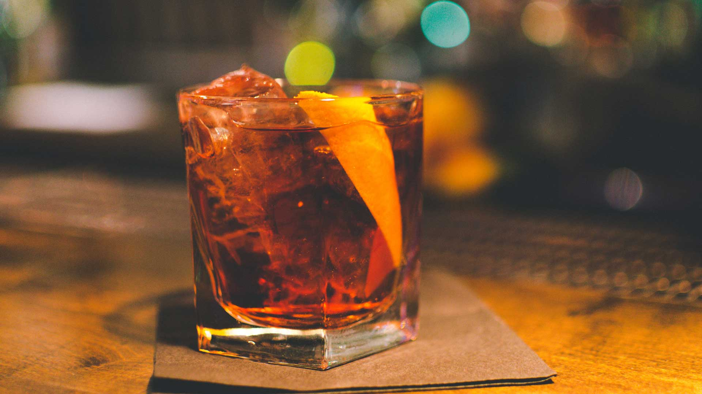

<!DOCTYPE html>
<html lang="es">
    <head>
        <meta charset="UTF-8">
        <title>ABC de los Cocteles</title>
    <link rel="stylesheet" href="./css/styles.css">
    <link href="https://fonts.googleapis.com/css2?family=Caveat&family=Merriweather:ital@1&family=Sansita+Swashed:wght@300&display=swap" rel="stylesheet">
    <link rel="stylesheet" href="https://cdnjs.cloudflare.com/ajax/libs/flexboxgrid/6.3.1/flexboxgrid.min.css">
    <link rel="stylesheet" href="https://cdnjs.cloudflare.com/ajax/libs/animate.css/4.0.0/animate.compat.css">
    </head>
    <body class="backstyle">
        

            

                

                <article class="body ">
                    <header class="textcenter">
                    
                    <h1 class="colortext fontstyle title dimension animated zoomInDown" > ABC de los Cocteles</h1>
                    </header>
                </article>
                <header class="mainheader animated zoomIn" style="font-size:20px;">
                    <nav class="main-nav">
                        <a href="index.html" class="navlink">Inicio</a>
                        <a href="utensilios.html" class="navlink">Utensilios</a>
                        <a href="recetas.html" class="navlink">Recetas</a>
                        <a href="informacion.html" class="navlink">Información</a>
                    </nav>
                </header>
                    

                        

                            

                                

                                    <h2>Los Cocteles</h2>
                                    
                                    
Recibe el nombre de coctel la bebida que se obtiene por la mezcla de dos o más licores,
                                        vinos en gran variedad, bitters, jugos(zumos) de fruta, jarabes y otros elementos, incluido
                                        el hielo, parte fundamental que acentúa o rebaja el sabor fuerte de las bebidas alcohólicas y facilita
                                        la mezcla de los diversos ingredientes.  Estas bebidas se sirven en copas adecuadas a sus características y pueden ser tomadas a manera de aperitivos,
                                        refrescantes, estimulantes.etc., o como parte fundamental de eventos sociales del mismo nombre (cocteles).  
                                    

                                

                            

                        

                    

                    <h2>Clasificación</h2>
                    

                        

                            

                                

                                    <h3>COOBLERS</h3>
                                    
                                    
Bebidas refrigerantes usadas principalmente en países o regiones cálidas. Se caracterizan por llevar frutas
                                        frescas en su composicion y se preparan en copas especiales, pero si no las hay
                                        se utilizan copas de agua o de champaña.
                                        Otros ingredientes son el hielo picado y licores como champaña, jerez, whisky y coñac.  
                                    

                                

                            

                            

                                

                                    <h3>COLLINS</h3>
                                    
                                    
Bebidas largas que se combinan directamente en el vaso donde van a servirse. se
                                        preparan en vaso alto y se sirven con pitillos.  
                                    

                                

                            

                            

                                

                                    <h3>COOLERS</h3>
                                    
                                    
Bebidas de carácter resfrescante caracterizadas por un bajo grado alcohólico.
                                        su preparacion suele terminarse con ginger-ale y con licores como el coñac, el ron, el jerez, entre otros.  
                                    

                                

                            

                            

                                

                                    <h3>CRUSTAS</h3>
                                    
                                    
Bebidas largas muy semejantes al coobler, que se caracterizan por la técnica de su
                                        presentación y por incluir al limón entre sus componentes. Se sirven en copas especiales o de
                                        agua, con el borde previamente humedecido en jugo de limón y escarchado con azúcar granulada o en
                                        polvo y provistas de una espiral de corteza de limón sobre la cual se vierte la bebida,
                                        que se ha preparado aparte. Se sirve con pitillos.  
                                    

                                

                            

                            

                                

                                    <h3>CUPS</h3>
                                    
                                    
Bebidas refrescantes que se preparan generalmente en jarras adecuadas y luego se sirven en copas.
                                        Entre sus ingredientes figuran champañas y otros vinos blancos acompañados de diversos licores,
                                        trocitos de frustas frescas(manzana, melocotón, pera, cereza, entre otros.  
                                    

                                

                            

                            

                                

                                    <h3>DAISIES</h3>
                                    
                                    
Cocteles derivados del coobler, de gran aceptación entre las damas. suelen prepararse
                                        en temporadas calurosas y se sirven en vaso grando o copa balón, grande también.  
                                    

                                

                            

                            

                                

                                    <h3>EGG-NOGS</h3>
                                    
                                    
Bebidas reconfortantes y de gran poder nutritivo, que se pueden preparar frias o calientes, por lo cual
                                        sirven tanto para el verano como para el invierno. Sus componentes principales son la leche y el huevo. Los egg-ogs
                                        frios pueden prepararse en coctelera o directamente en el vaso; y los calientes en vasos altos resistenteas al calor.  
                                    

                                

                            

                            

                                

                                    <h3>FIXES</h3>
                                    
                                    
Bebidas ideales para las horas de la tarde, por sus cualidades tónicas y refrescantes.
                                        Son de fácil preparación.  
                                    

                                

                            

                            

                                

                                    <h3>FIZZES</h3>
                                    
                                    
Bebidas muy solicitadas, basadas en el jugo de limón. Se pueden consumir en ayunas. Sus preparaciones
                                        son muy variadas pero la más popular es el Gin-Fizz  
                                    

                                

                            

                            

                                

                                    <h3>FLIPS</h3>
                                    
                                    
Bebidas que, por llevar huevo, se indican para el desayuno o la merienda.
                                         Son mezclas que datan desde la antigüedad, tales como jerez, Madeira u oporto
                                        combinados con huevo.  
                                    

                                

                            

                            

                                

                                    <h3>FRAPPÉS</h3>
                                    
                                    
Bebidas muy populares en la actualidad, solicitadas especialmente por las damas, como
                                        sobremesa a la hora de la cena. Su preparación es sencilla: basta llenar una copa flauta con
                                        hielo molido y verter sobre él el licor deseado. Se sirven con pitillos  
                                    

                                

                            

                            

                                

                                    <h3>GROGS</h3>
                                    
                                    
Bebidas clásicas para los días frios. Suelen prepararse con agua bien caliente, té o vino.  
                                    

                                

                            

                            

                                

                                    <h3>HIGHBALLS</h3>
                                    
                                    
Bebidas largas compuestas por un licor determinado, que se sirven en vaso mediano
                                        acompañadas de unos cubitos de hielo y soda o ginger-ale.  
                                    

                                

                            

                            

                                

                                    <h3>JULEPS</h3>
                                    
                                    
Especiales para climas templados y cálidos. Se caracterizan por llevar hojas de menta o
                                        hierbabuena, que los hacen refrescante. Se preparan en vaso mediano en el que se
                                        dispone  almibar con unas hojas de menta fresca, las cuales se retiran; luego de añadir el
                                        licor deseado, se remueve y se pasa a vaso alto provisto de hielo picado.  
                                    

                                

                            

                            

                                

                                    <h3>MULERS</h3>
                                    
                                    
Bebidas combinadas cuyo principal componente es la cerveza  
                                    

                                

                            

                            

                                

                                    <h3>PICK-ME-UPS</h3>
                                    
                                    
Cocteles que utilizan champaña como licor base. Se preparan en coctelera y se sirven en copa flauta  
                                    

                                

                            

                            

                                

                                    <h3>POUSSE-CAFÉS</h3>
                                    
                                    
Bebidas que retan la experiencia y el arte del barman. Consta de varios licores de diferentes
                                        densidades y colores, que flotan alternativamente. Su gran variedad permite utilizar entre
                                        un minimo de tres y un máximo de siete, que se dejan caer por las paredes de la copa o por el dorso
                                        de una cuchara.  
                                    

                                

                            

                            

                                

                                    <h3>PUFFS</h3>
                                    
                                    
Bebidas en cuya composición figura la leche. Su preparación es sencilla.  
                                    

                                

                            

                            

                                

                                    <h3>PUNCHES</h3>
                                    
                                    
Su nombre deriva del indostánico panch (cinco) a causa de los cincos componentes que entran en su composición.
                                        Para su preparación se colocan en una ponchera unas rodajas de limón con corteza y sobre
                                        ellas se cierte té hirviente, azúcar, canela y ron, los cncos ingredientes clásicos. Se puede o no flamear.  
                                    

                                

                            

                            

                                

                                    <h3>RICKEYS</h3>
                                    
                                    
Bebidas ideales para la media tarde. Su ingrediente principal, el jugo de limón, se adiciona con el
                                        licor preferido y se completa con soda.  
                                    

                                

                            

                            

                                

                                    <h3>SANGAREES</h3>
                                    
                                    
Bebidas muy tropicales cuya característica principal es que se espolvorean con nuez
                                        moscada.  
                                    

                                

                            

                            

                                

                                    <h3>SCAFFAS</h3>
                                    
                                    
Bebidas de preparación igual a la de los pousse-cafés, tanto que pueden confundirse   
                                    

                                

                            

                            

                                

                                    <h3>SHRUBS</h3>
                                    
                                    
Bebidas cuya base de preparación puede ser agua caliente o soda. En el primer caso (calientes)
                                        se consideran como ponches y en el segundo (fríos) como aperitivos.  
                                    

                                

                            

                            

                                

                                    <h3>SLING</h3>
                                    
                                    
Bebidas compuestas, refrescantes o reconfortantes, según se preparen frías o calientes.
                                        Las frías se preparan en la coctelera y las calientes en vasos resistentes al calor.  
                                    

                                

                            

                            

                                

                                    <h3>SMASHES</h3>
                                    
                                    
Bebidas largas parecidas a los juleps, refrescantes, que llevan en su preparación
                                        hojas de menta fresca.  
                                    

                                

                            

                            

                                

                                    <h3>SOURS</h3>
                                    
                                    
Cocteles agrios que deben adicionarse con una buena cantidad de jugo de limón. Se
                                        pueden agregar trocitos de fruta fresca y completar con soda, agua de seltz, perrier o cristal.  
                                    

                                

                            

                            

                                

                                    <h3>SPECIA BULLSHOT</h3>
                                    
                                    
Combinaciones que llevan entre sus ingredientes el consomé de carne.  
                                    

                                

                            

                            

                                

                                    <h3>TODDIES</h3>
                                    
                                    
Bebidas muy parecidas a los slings y a los grogs, por lo cual se incluyen en estos grupos.  
                                    

                                

                            

                            

                                

                                    <h3>ZOOMS</h3>
                                    
                                    
Cocteles caracterizados por llevar en sus componentes miel de abejas, algunas veces
                                        crema de leche y como base alcohólica el licor elegido.  
                                    

                                

                            

                        

                    

                

            

        

    </body>
</html>
